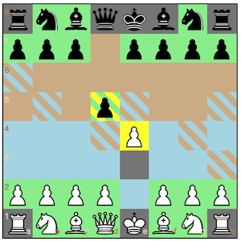
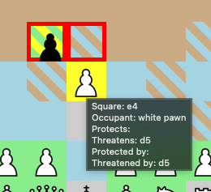
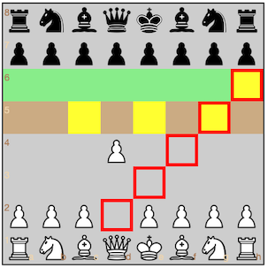

# Django Chess Inspector
Visualize chess piece move, threat, and protection status.

Coverage:



Mouse hover:



Possible moves (for black):



---

## Install and run:

```
git clone https://github.com/ology/django-chess-inspector.git
cd django-chess-inspector
python3 -m venv .
source ./bin/activate
pip install chess chess_coverage
pip install django
pip install channels channels["daphne"]
cd chess-inspector/
vim chess-inspector/inspector/settings.py # set the ALLOWED_HOSTS & CSRF_TRUSTED_ORIGINS
python3 manage.py runserver 192.168.99.50:8080
```

~

```
pip install gunicorn
GUNICORN_CMD_ARGS="--bind=192.168.99.50:8080 --workers=3 --timeout 120" gunicorn inspector.wsgi:application
```

## Description

**This is not a chess "engine." It doesn't track or follow gameplay rules. It allows moving anything anywhere, at any time.**

* Blue = white can move to that square
* Brown = black can move there
* Striped blue and brown = both can move there
* Yellow = the piece on the square is threatened
* Green = that piece is protected by another piece
* Striped yellow and green = both can capture or protect that square

Hovering (if on computer) or tapping (phone) on a piece shows where it can can move in red.

Also hovering pops up a description of the square and its threat/protection/etc status.
