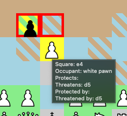
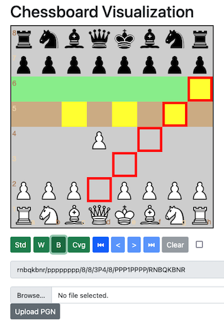

# Django Chess Inspector
Visualize chess piece move, threat, and protection status.

Coverage:


Mouse hover:



Possible moves (for black):



---

## Install and run:

```
git clone https://github.com/ology/django-chess-inspector.git
cd django-chess-inspector
python3 -m venv .
source ./bin/activate
pip install chess chess_coverage
pip install django
pip install channels channels["daphne"]
cd chess-inspector/
python3 manage.py runserver 192.168.100.50:8080
```

~

```
pip install gunicorn
GUNICORN_CMD_ARGS="--bind=192.168.100.50:8080 --workers=3 --timeout 120" gunicorn inspector.wsgi:application
```
